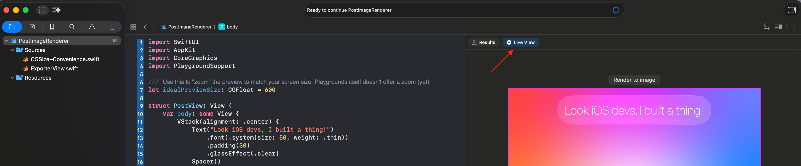

# PostImageRenderer

You are an iOS developer and want to make social media or blog post images that look like right out of an app?

Use this playground! All you need is your knowledge of SwiftUI. Build a view, provide the desired image dimensions, preview it via Xcode Playgrounds, press export. 🎉

## How to use

First off, when opening the playground, on the top of the "Results Canvas" in Xcode, there is a "Live View" tab. Head there to see the view preview instead of code execution details.

Build a SwiftUI view to your heart's content and use the export button. You can specify the desired image dimensions and file path at the bottom of the main code block. This playground supports exportint JPG and PNG files. Image quality is set to 100% to prevent compression. For best image quality I'd still recommend exporting to PNG.

There also is a `scale` property. It effectively multiplies the `exportSize`. Apple's default is `1.0`, which you can think of a "non retina" display, resulting in a poor export quality. This playground sets this value to `3.0` and gets a much better export quality. You may however need to manually resize the image after export.

## Known issues

Now there are things that do not work exactly as desired. Apple probably didn't intend Liquid Glass effects to be rendered to a PNG and it seems they have missed a few things on that front.

- Using `.glassEffect(.clear.tint(Color.black.opacity(0.1)))` will look fine in the preview, but not in the exported image. Use `.glasEffect(.clear).background(Color.black.opacity(0.1))` instead. There is an example usage in the playground code that includes a clip shape.
- Some times when combining views in an `HStack` and then applying a `.glassEffect` will look fine in preview, but the only thing rendered is the glass capsule, not the content. This however can easily be fixed by adding the content a second time as an overlay.
- Some times the playground gets stuck in reloading and the live view doesn't load. Simply edit the code, remove a character and add it again, and that will help Xcode get unstuck.

## Contribute

This is just a small helper for myself, but feel free to add functionality and make PRs!

## Share what you made!

I'm curious to see what use case you come up with! Send pics :)
